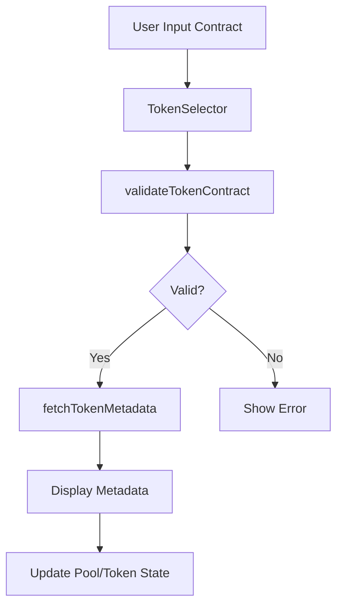

# Multi-Token Support Architecture Design

## Overview

This design extends the Stacks Decentralized Exchange frontend to support real Stacks fungible tokens (SIP-010 compliant) instead of mock tokens. The AMM contract already supports trait-based tokens, so the focus is on frontend enhancements for token discovery, metadata handling, validation, and improved UX.

## Acceptance Criteria

- **Real token integration**: Support SIP-010 compliant tokens
- **Token discovery interface**: Manual input with validation, basic registry
- **Cross-token pool support**: Ensure UX for creating pools between any valid tokens
- **Token metadata display**: Show name, symbol, decimals in UI
- **Token validation and verification**: Check trait implementation

## Current State Analysis

### Token Handling
- Tokens are represented as contract principal strings (e.g., "ST3P49R8XXQWG69S66MZASYPTTGNDKK0WW32RRJDN.mock-token")
- No metadata fetching; displays contract name by splitting on "."
- Manual input in create-pool component
- Pools fetched from contract events, tokens stored as principals

### Components
- `swap.tsx`: Dropdowns populated from existing pools, displays contract names
- `create-pool.tsx`: Text inputs for token contracts
- `pools.tsx`: Displays token pairs with contract names and balances

## Architecture Design

### 1. Token Metadata Types

```typescript
export interface TokenMetadata {
  contractAddress: string;
  name: string;
  symbol: string;
  decimals: number;
  totalSupply?: number;
  tokenUri?: string;
}

export interface TokenValidation {
  isValid: boolean;
  implementsSip010: boolean;
  error?: string;
}
```

### 2. Token Utilities (`lib/token-utils.ts`)

#### Metadata Fetching
- `fetchTokenMetadata(contractAddress: string): Promise<TokenMetadata>`
  - Calls `get-name()`, `get-symbol()`, `get-decimals()` read-only functions
  - Handles errors gracefully with fallbacks

#### Validation
- `validateTokenContract(contractAddress: string): Promise<TokenValidation>`
  - Checks if contract implements SIP-010 trait
  - Verifies required functions exist and return expected types

#### Registry (Basic)
- `getKnownTokens(): TokenMetadata[]`
  - Returns hardcoded list of known tokens for initial registry
  - Can be expanded to fetch from external registry later

### 3. Updated Pool Type

```typescript
export type Pool = {
  id: string;
  token0: TokenMetadata;
  token1: TokenMetadata;
  fee: number;
  liquidity: number;
  balance0: number;
  balance1: number;
};
```

### 4. Token Discovery Interface

#### TokenSelector Component
- Input field for contract address
- Validation feedback (real-time)
- Search/filter for known tokens
- Display of token metadata when selected

#### TokenRegistry Component
- List of known tokens with metadata
- Search functionality
- Add custom token option

### 5. Component Updates

#### Swap Component
- Use TokenSelector for from/to tokens
- Display token symbols instead of contract names
- Format amounts with proper decimals

#### Create Pool Component
- Two TokenSelector instances
- Validation ensures both tokens are valid SIP-010
- Display token metadata in confirmation

#### Pools Display
- Show token symbols and names
- Format balances with decimals
- Links to token contracts

### 6. Data Flow



### 7. State Management

#### Token Cache
- In-memory cache for fetched metadata
- Prevents redundant API calls
- TTL-based expiration

#### Pool Enhancement
- Modify `getAllPools()` to fetch metadata for each token
- Cache token metadata separately from pools

### 8. Error Handling

- Graceful degradation when metadata fetch fails
- Fallback to contract address display
- User feedback for invalid tokens
- Loading states during validation

### 9. Integration Points

#### Existing Components
- `swap.tsx`: Update token selection and display
- `create-pool.tsx`: Add token validation
- `pools.tsx`: Enhance display with metadata
- `add-liquidity.tsx`, `remove-liquidity.tsx`: Format with decimals

#### New Components
- `TokenSelector.tsx`: Reusable token input component
- `TokenDisplay.tsx`: Consistent token metadata display
- `TokenRegistry.tsx`: Token discovery interface

### 10. Performance Considerations

- Cache token metadata to avoid repeated fetches
- Batch metadata requests where possible
- Lazy load token validation
- Optimize pool data fetching with metadata

### 11. Future Extensions

- External token registry integration
- Token search API
- Favorite tokens
- Token balance display
- Cross-chain token support (when available)

## Implementation Plan

1. Create token utilities (`lib/token-utils.ts`)
2. Update Pool type and amm.ts functions
3. Implement TokenSelector component
4. Update existing components to use new types
5. Add token registry functionality
6. Implement caching and error handling
7. Testing and validation

This design maintains backward compatibility while adding comprehensive token support, ensuring a smooth transition from mock to real tokens.